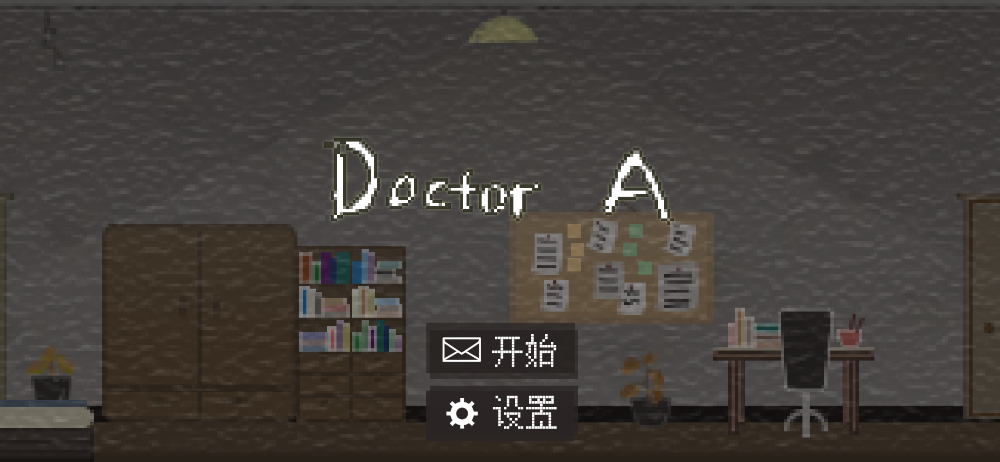
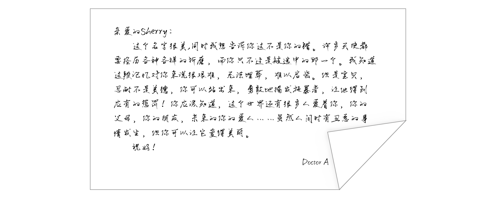
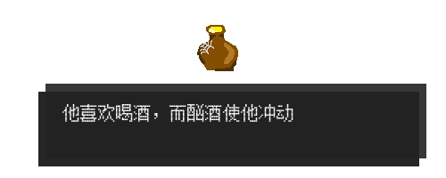

# Tencent Game Design Course Work
## Introduction
This is a individual game on Android device I developed during the Tencent Game Design course serveral years ago. At that time, I was very interested in game development and wanted to be a individual game developer in the future. I worked with other two artists and one writer on this game. This game may seems to be a little plain at this time, but we did have a lot fun developing it. The main gameplay is pinball and puzzle.
## Some snapshots
#### Main Scene

#### Some components for plot promotion

## Play
Just download the test.apk file and install on your mobile phone.
## Support
Only have Chinese version.
